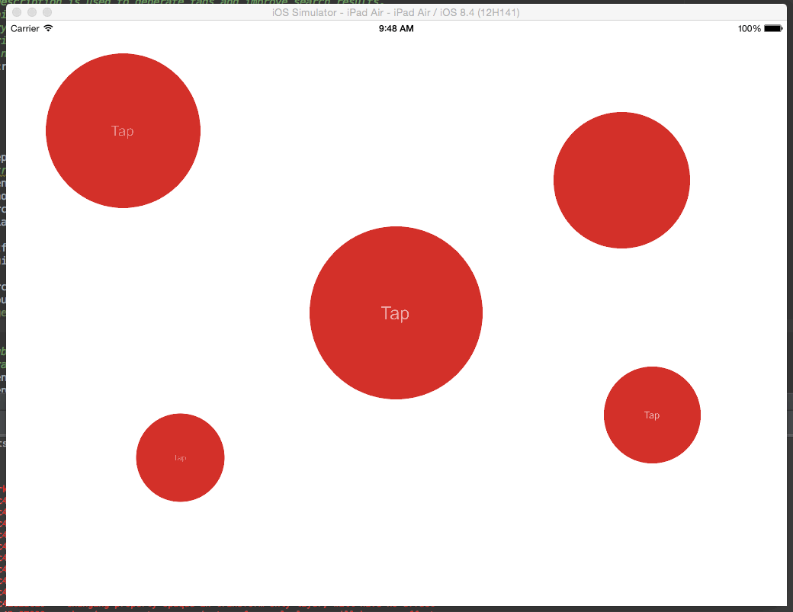
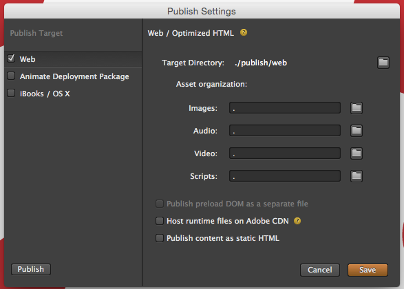
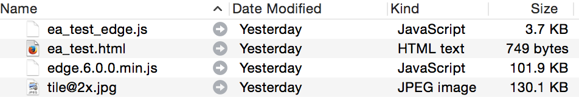
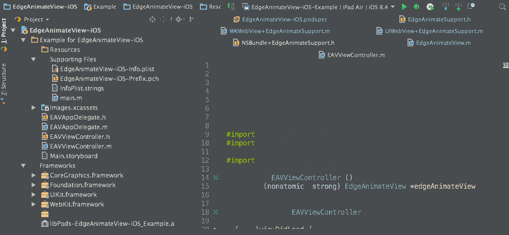

# EdgeAnimateView-iOS

[](https://travis-ci.org/aceontech/EdgeAnimateView-iOS)
[](http://cocoapods.org/pods/EdgeAnimateView-iOS)
[](http://cocoapods.org/pods/EdgeAnimateView-iOS)
[](http://cocoapods.org/pods/EdgeAnimateView-iOS)

EdgeAnimateView provides **one-liner support for displaying Adobe Edge Animate**
compositions on iOS devices. Depending on the target OS (iOS 7, 8 or 9),
EdgeAnimateView will pick the right web view and configure it for you. On iOS
versions 8 and up, **WKWebView** is used, which provides native Safari web
performance for your animations.



Features:

* Local and remote loading of Adobe Edge Animate animations
* String localization support [new since 1.1]

## Installation

EdgeAnimateView-iOS is available through [CocoaPods](http://cocoapods.org). To install
it, simply add the following line to your Podfile:

```ruby
pod "EdgeAnimateView-iOS"
```

## Usage

The demo project provides an Objective-C iOS app which displays a locally bundled demo animation.

### Local animations stored in the application bundle

Displaying local Adobe Edge Animate animations can be as easy as creating an instance
of `EdgeAnimateView` and loading a `.bundle`-directory containing the published output from
Adobe Edge Animate:

```objc
self.edgeAnimateView = [[EdgeAnimateView alloc] init];
[self.edgeAnimateView loadEdgeAnimateBundleName:@"ea_test"]; // will load ea_test.bundle from the app bundle
```

To learn how to bundle your Edge Animate files, see the [Bundling local files](#bundling) section.

### Web-hosted animations

Similarly, remote animations can be loaded like so:

```objc
self.edgeAnimateView = [[EdgeAnimateView alloc] init];
[self.edgeAnimateView loadEdgeAnimateURL:[NSURL URLWithString:@"http://www.domain.tld/path/to/your/animation.html"]];
```

## <a name="bundling"></a>Bundling local files

Because of the way iOS loads files stored in the app bundle (file hierarchies are
flattened, no directories can exist within an `.ipa`) and how Xcode copies
non-code resources into the app bundle by default (`.js` files are bundled as
code, but should be bundled as resource), it's more convenient to wrap your
Edge Animate files in a directory with the `.bundle` extension, as Xcode
automatically bundles these as resources.

This currently involves 4 steps. I may write a script at some point to automate the process.

### 1. Edge Animate Publish settings

To make Adobe Edge Animate produce a flat file structure (html, js and resources
in the root directory), set your publish settings to:



Note "Host runtime files on Adobe CDN" is unchecked, so the runtime JS file will
be included in the publish directory.

### 2. Modify JavaScript include

You also need to tweak the `.html` output to reference the Edge javascript
library from the root directory.

Change your HTML from (line ~8):

```html
<script type="text/javascript" charset="utf-8" src="edge_includes/edge.6.0.0.min.js"></script>
```

to

```html
<script type="text/javascript" charset="utf-8" src="edge.6.0.0.min.js"></script>
```

### 3. Copy to `.bundle` directory in app

In your application source directory, create a directory with the `.bundle`
extension, e.g. `ea_test.bundle`, and copy the published files that Edge Animate
generated.

Note: If you're having trouble opening the `.bundle` directory after you've created it,
you can right-click it and select **"Show package contents"**.

An example file structure:



You can always see what a working file structure looks like [here](https://github.com/aceontech/EdgeAnimateView-iOS/tree/master/Example/EdgeAnimateView-iOS/Resources/ea_test.bundle).

### 4. Add to your Xcode project

#### Using Xcode

Simply drag the `.bundle` directory into the Project Navigator.

#### Using AppCode

AppCode references folders differently by default. To add the `.bundle` directory properly,
remember to check the radio button labeled **"Create folder references for folders"**:



## Requirements

* iOS 7.0 or higher
* Adobe Edge Animate for creating HTML5 animations

## Documentation

### EdgeAnimateSupport.h

Defines the interface for Edge Animate loading support (protocol).

### EdgeAnimateView.h

Wrapper class around `WKWebView+EdgeAnimateSupport` or `UIWebView+EdgeAnimateSupport`
(depending on iOS target version).

The above classes can be used directly if more flexibility is required.

### WKWebView+EdgeAnimateSupport

This category adds support for loading local Edge Animate animations to `WKWebView`.
Because iOS 8's implementation of `WKWebView` prevents loading content from the
local file system, this category employs a workaround which copies the animation
`.bundle` to `/tmp/www` and loads it from there.

### UIWebView+EdgeAnimateSupport

Adds the same support to the standard UIWebView.

### NSBundle+EdgeAnimateSupport.h

Adds embedded bundle loading to `NSBundle`.

## Author

Alex Manarpies, [aceontech.com](http://www.aceontech.com)

## License

EdgeAnimateView-iOS is available under the MIT license. See the LICENSE file for more info.
